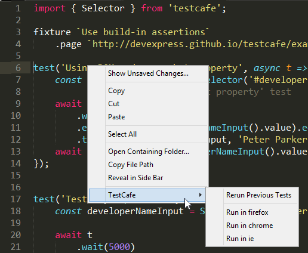
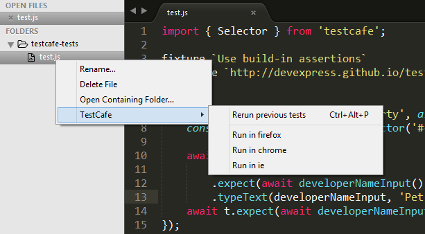
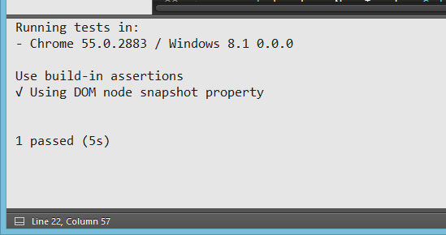
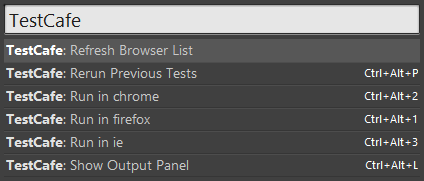

#TestCafe Test Runner for SublimeText

The **TestCafe TestRunner** plugin allows you to run TestCafe tests directly from your SublimeText editor. Tests results will be displayed in a separate panel.

##Requirements

This plugin requires that TestCafe is installed globally on your machine. For instructions on how to install TestCafe, refer to the [Installing TestCafe](https://devexpress.github.io/testcafe/documentation/getting-started/#installing-testcafe) article. 

##How to install

You can install the **TestCafe Test Runner** plugin like any other SublimeText plugin, as described in SublimeText [documentation](https://www.sublimetext.com/docs/3/packages.html).

##How it works
###Initialization
During initialization, the plugin detects browsers installed on your machine. The **TestRunner** plugin generates new items in the context menu for each installed browser. These items allows you to run tests in a selected browser.

###Running a particular test
To run a particular test, you should place the cursor within the test body and select the required browser from the context menu. 
###Running tests of a particular test fixture
To run all the tests from a particular test fixture, place the cursor in this fixture (but outside of a test body), and select the required browser from the context menu.
###Running all the tests from a test file
To run all the tests from the current file, invoke a context menu when the cursor is placed outside of any fixture, and select the required browser from the context menu.
You can also run all tests in a file using the side bar context menu.

###Rerunning previous tests
If you need to run the same set of tests you ran previously, invoke the context menu and select the Rerun Previous Tests item.
###View results
You can view test execution results in a special panel opened using the `Ctrl+Alt+L` shortcut.

##Commands and shortcuts

* *Run in chrome* (firefox, ie) (`CTRL+ALT+1,2,3…`) - runs a test or fixture at the cursor position in the required browser. 
* *Rerun previous tests* (`CTRL+ALT+P`) - reruns a set of tests that was run previously.
* *Show output panel* (`CTRL+ALT+L`) - opens the TestCafe output panel.
* *Refresh browser list* – forces plugin reinitialization. When initialized, plugin detects all the installed browsers. Use this command to update browser list when you have installed or uninstalled a browser.

